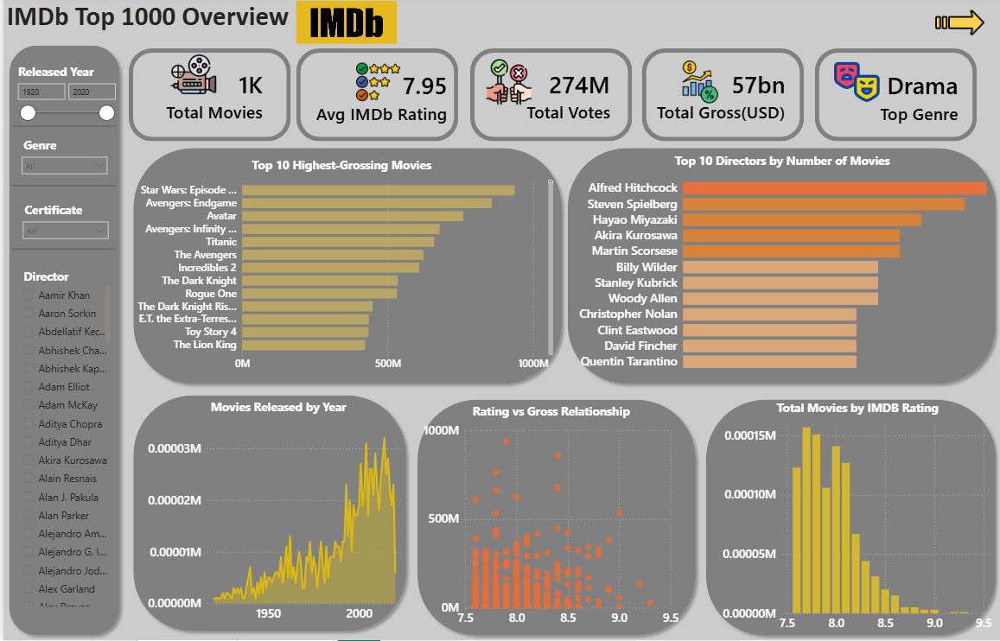
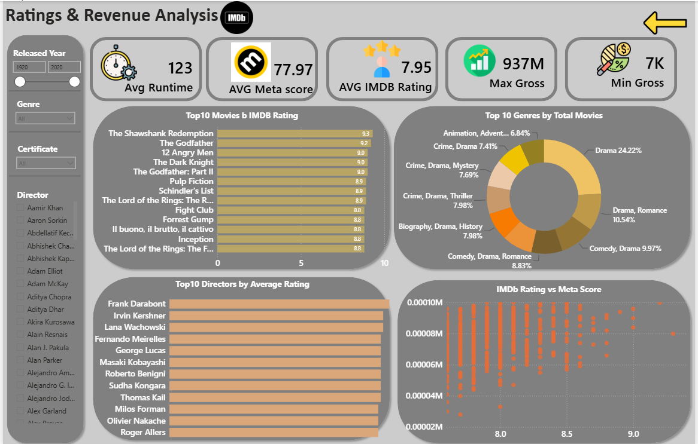

# IMDB-Top1000-PowerBI-Dashboard
Power BI analysis of IMDb Top 1000 movies with ratings, revenue, genres, directors, and trends.


## 📌 Project Overview

The goal of this project is to transform the IMDb Top 1000 Movies dataset into a clear and interactive analytical dashboard that makes it easier to identify patterns and compare movies across multiple dimensions.

The dataset contains **1,000 movies and 16 columns**, including:

* Movie title
* Release year
* Certificate
* Runtime
* Genre
* IMDb rating
* Meta Score
* Director
* Main cast
* Number of votes
* Gross revenue
* Movie overview

The Power BI report is organized into **two analysis pages**, combining KPI cards, charts, Top-N analysis, and interactive slicers.

---

## 🔍 Analysis Key

This dashboard was designed to answer questions such as:

* Which movies generated the highest gross revenue?
* Which directors have the largest number of highly rated movies?
* How has the number of released movies changed over time?
* Is there a relationship between IMDb rating and gross revenue?
* How closely do IMDb Rating and Meta Score relate to each other?
* Which movies have the highest IMDb ratings?
* Which directors have the highest average ratings?
* Which genres appear most frequently in the IMDb Top 1000?
* How do movie results change when filtering by year, genre, certificate, or director?

---

## 🗝 Key Concepts Used

* **Data Cleaning & Transformation** — preparing fields such as Gross, Runtime, ratings, and missing values for analysis.
* **Power BI Data Modeling** — organizing the IMDb dataset and dedicated DAX measures for reporting.
* **DAX Measures** — metrics such as Total Movies, Total Gross, Total Votes, Average IMDb Rating, Average Runtime, Maximum Gross, and Minimum Gross.
* **KPI Cards** — presenting important metrics in an easy-to-read format.
* **Top-N Analysis** — identifying top movies, directors, and genres.
* **Interactive Slicers** — filtering the report by Released Year, Genre, Certificate, and Director.
* **Scatter Analysis** — examining relationships between IMDb Rating, Meta Score, and Gross Revenue.
* **Trend Analysis** — analyzing movie releases across years.
* **Data Visualization & Storytelling** — using bar charts, column charts, area charts, scatter plots, donut charts, and cards to communicate insights clearly.

---

## 📊 Outputs

### Dashboard Page 1 — Movie Performance Overview



Main analysis includes:

* Total Movies
* Total Gross Revenue
* Total Votes
* Average IMDb Rating
* **Top 10 Highest-Grossing Movies**
* **Top 10 Directors by Number of Movies**
* **Movies Released by Year**
* **Rating vs Gross Relationship**
* **Total Movies by IMDb Rating**
* Filters for Released Year, Genre, Certificate, and Director

### Dashboard Page 2 — Ratings, Genres & Directors



Main analysis includes:

* Maximum and Minimum Gross Revenue
* Average Runtime
* IMDb Rating and Meta Score analysis
* **IMDb Rating vs Meta Score**
* **Top 10 Movies by IMDb Rating**
* **Top 10 Directors by Average Rating**
* **Top 10 Genres by Total Movies**
* Filters for Released Year, Genre, Certificate, and Director

### Dataset Snapshot

* **Rows:** 1,000 movies
* **Columns:** 16
* **Release years:** approximately 1920–2020
* **Average IMDb Rating:** ~7.95
* **IMDb Rating Range:** 7.6–9.3
* **Highest Grossing Movie:** *Star Wars: Episode VII – The Force Awakens*
* **Highest Gross:** approximately **$936.7M**
* **Director with the most movies:** Alfred Hitchcock — **14 movies**

---

## 🚀 How to Run

### Requirements

* Microsoft Power BI Desktop

### Steps

1. Clone or download this repository.
2. Keep the `.pbix` and `.csv` files in the project folder.
3. Open `imdb project(1).pbix` using **Power BI Desktop**.
4. If Power BI cannot locate the original CSV source, go to **Transform Data → Data Source Settings → Change Source**.
5. Select `imdb_top_1000(2).csv` from your local project folder.
6. Click **Refresh** to reload the dataset.
7. Use the slicers and visuals to explore the dashboard interactively.

```bash
git clone <your-repository-url>
```

### Suggested Repository Structure

```text
IMDb-PowerBI-Project/
│
├── imdb project(1).pbix
├── imdb_top_1000(2).csv
├── README.md
└── images/
    ├── dashboard-page-1.png
    └── dashboard-page-2.png
```

---

## 📝 Notes

* The original dataset contains missing values in some fields: **Certificate (101)**, **Meta_score (157)**, and **Gross (169)**.
* `Gross` is provided with comma-separated values in the source CSV and should be treated as a numeric field for calculations.
* `Runtime` is originally stored in a format such as `142 min`; numeric runtime values are required for average runtime analysis.
* The `Genre` field can contain multiple genres in one value, for example `Action, Crime, Drama`.
* The dataset contains historical movie information and should be treated as an analytical/portfolio dataset rather than live IMDb data.
* GitHub cannot preview `.pbix` files directly, so adding dashboard screenshots to the repository is recommended.

---

## 👤 About Me
📩 Contact: [govharorucova@outlook.com] 🌐 GitHub: [https://github.com/GovharOrujova]

[https://www.linkedin.com/in/govhar-orujova-64333b369/]
